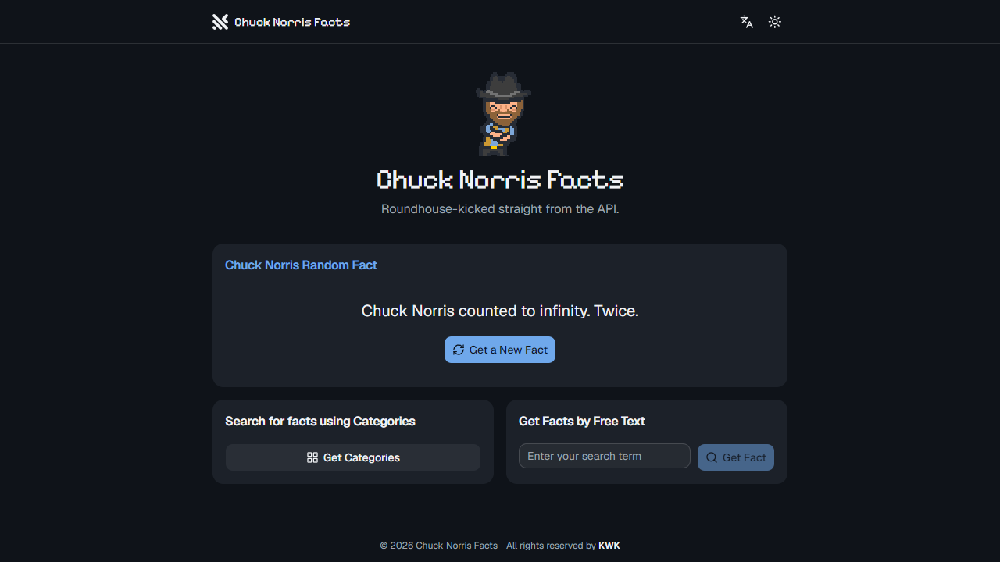

# Chuck Norris Facts 🥋

<div align="center">
  <a href="./README.md">English</a> · <strong>Português</strong>
</div>

Uma aplicação full-stack em React que entrega fatos aleatórios do Chuck Norris e permite buscá-los por texto ou por categoria. Backend em GraphQL e Apollo Client no cliente, para busca de dados e gerenciamento de estado.

<div align="center">
  
</div>

---

## 🚀 Demo

Veja funcionando: **[https://chuck-norris-facts-kwk.vercel.app/](https://chuck-norris-facts-kwk.vercel.app/)**

---

## ✨ Funcionalidades

- 🎲 **Fatos aleatórios**: um fato novo do Chuck Norris a cada clique
- 🔍 **Busca**: por texto livre ou navegando pelas categorias
- 🌙 **Tema escuro persistente**: alterna entre claro e escuro e guarda a escolha no `localStorage`
- 🌍 **Dois idiomas**: inglês e português, detectados do navegador
- 📱 **Responsivo**: pensado para qualquer tamanho de tela
- ⚡ **GraphQL**: busca de dados eficiente com Apollo Client
- 🎨 **Interface moderna**: shadcn/ui sobre primitivos Radix, estilizado com Tailwind
- 🔧 **TypeScript**: tipagem de ponta a ponta

---

## 🏗️ Arquitetura

A API é servida na **mesma origem** que a aplicação em todos os ambientes — a
Vercel roteia `/api/graphql` para a função, a imagem nginx faz proxy para o
contêiner do servidor, e o dev server do Vite faz proxy para `localhost:4000`.
Por isso o cliente não precisa de nenhuma URL de API configurada, e o navegador
nunca dispara um preflight de CORS.

### Frontend (client)
- **React 19** com TypeScript
- **React Compiler** para memoização automática — sem `useCallback`/`useMemo` escritos à mão
- **Vite** para o dev server e o build de produção
- **Apollo Client** para o estado GraphQL
- **shadcn/ui** sobre primitivos Radix, estilizado com **Tailwind CSS v4**
- **i18next** para inglês e português
- **Lucide React** para os ícones

### Backend (server)
- **Node.js** com **Express**
- API **GraphQL** servida por graphql-http
- **TypeScript** no servidor
- **Axios** para a integração com a API externa
- **Helmet** e **CORS** para segurança

---

## 🛠️ Stack

### Dependências do frontend
| Pacote | Versão | Função |
|--------|--------|--------|
| React | ^19.2.8 | Biblioteca de UI |
| Apollo Client | ^3.14.1 | Cliente GraphQL |
| Vite | ^8.2.0 | Ferramenta de build |
| babel-plugin-react-compiler | ^1.0.0 | Memoização automática |
| shadcn/ui (radix-nova) | — | Camada de componentes |
| Tailwind CSS | ^4.3.3 | Estilização |
| i18next / react-i18next | ^26 / ^17 | Internacionalização |
| TypeScript | ^5.9.3 | Tipagem |
| Lucide React | ^0.539.0 | Ícones |
| Vitest | ^4.1.10 | Testes unitários |

### Dependências do backend
| Pacote | Versão | Função |
|--------|--------|--------|
| Express | ^4.19.2 | Framework web |
| GraphQL | ^16.11.0 | Linguagem de consulta |
| graphql-http | ^1.22.4 | GraphQL sobre HTTP |
| Axios | ^1.7.2 | Cliente HTTP |
| Pino | ^9.6.0 | Log estruturado |
| TypeScript | ^5.4.5 | Tipagem |

---

## 🚀 Como rodar

### Pré-requisitos
- Node.js `^20.19.0 || >=22.12.0` (o mínimo que o Vite 8 exige)
- npm

### Instalação

```bash
# Clone o repositório
git clone https://github.com/dev-kohako/chuck-norris-facts.git
cd chuck-norris-facts
```

### Backend

```bash
# Vá para o diretório do servidor
cd server

# Instale as dependências
npm install

# Crie o arquivo de ambiente
cp .env.example .env

# Suba o servidor de desenvolvimento
npm run dev
```

O servidor GraphQL fica em `http://localhost:4000/graphql`

### Frontend

```bash
# Vá para o diretório do cliente (em outro terminal)
cd client

# Instale as dependências
npm install

# Suba o dev server do Vite
npm run dev
```

A aplicação fica em `http://localhost:3000`, com `/api/graphql` já roteado por
proxy para o servidor acima — não é preciso `.env` a menos que você queira
apontar para uma API em outro lugar.

---

## 📜 Scripts disponíveis

### Frontend
| Comando | Descrição |
|---------|-----------|
| `npm run dev` | Sobe a aplicação no dev server do Vite, com a API por proxy |
| `npm run build` | Gera o build de produção em `dist/` |
| `npm run preview` | Serve o build de produção localmente |
| `npm test` | Roda os testes unitários (Vitest) |
| `npm run typecheck` | Checa tipos sem emitir arquivos |
| `npm run lint` | Roda o ESLint, incluindo os diagnósticos do React Compiler |
| `npm run cypress:open` | Abre o Cypress para os testes e2e |
| `npm run cypress:run` | Roda os testes do Cypress em modo headless |

### Backend
| Comando | Descrição |
|---------|-----------|
| `npm run dev` | Sobe o servidor GraphQL com hot reload |
| `npm run build` | Compila o TypeScript em `dist/` |
| `npm start` | Roda o servidor compilado |
| `npm test` | Roda os testes do servidor |
| `npm run typecheck` | Checa tipos de `src`, `api` e dos testes |

---

## 📁 Estrutura do projeto

```
chuck-norris-facts/
├── client/                          # Aplicação React
│   ├── index.html                   # Documento de entrada do Vite
│   ├── components.json              # Configuração do shadcn/ui
│   ├── public/
│   │   ├── chuck-logo.png
│   │   └── manifest.json
│   ├── src/
│   │   ├── components/
│   │   │   ├── ui/                  # Primitivos do shadcn/ui
│   │   │   ├── DarkModeButton/
│   │   │       ├── DarkModeButton.tsx
│   │   │       └── useDarkModeButton.ts
│   │   │   ├── Footer/
│   │   │       ├── Footer.tsx
│   │   │       └── useFooter.ts
│   │   │   ├── Header/
│   │   │       ├── Header.tsx
│   │   │       └── useHeader.ts
│   │   │   ├── LanguageSwitcher/
│   │   │       └── LanguageSwitcher.tsx
│   │   │   ├── Spinner/
│   │   │       └── Spinner.tsx
│   │   │   └── SearchByCategorySection/
│   │   │       ├── SearchByCategorySection.tsx
│   │   │       └── useSearchByCategorySection.ts
│   │   ├── i18n/
│   │   │   ├── index.ts
│   │   │   └── locales/
│   │   │       ├── en.json
│   │   │       └── pt.json
│   │   ├── lib/
│   │   │   └── utils.ts             # cn()
│   │   ├── assets/
│   │   │   └── images/
│   │   ├── pages/
│   │   │   ├── Categories/
│   │   │       ├── Categories.tsx
│   │   │       └── useCategories.ts
│   │   │   ├── FactByFreeText/
│   │   │       ├── FactByFreeText.tsx
│   │   │       └── useFactByFreeText.ts
│   │   │   └── RandomFact/
│   │   │       ├── RandomFact.tsx
│   │   │       └── useRandomFact.ts
│   │   ├── queries/
│   │   │   ├── getChuckNorrisByCategories.ts
│   │   │   ├── getChuckNorrisByText.ts
│   │   │   ├── getChuckNorrisCategories.ts
│   │   │   └── getChuckNorrisFact.ts
│   │   ├── types/
│   │   │   └── types.ts
│   │   ├── utils/
│   │   │   └── apolloClient.ts
│   │   ├── App.test.tsx
│   │   ├── App.tsx
│   │   ├── index.css                # Tema do Tailwind v4 + tokens do shadcn/ui
│   │   ├── index.tsx
│   │   ├── setupTests.ts
│   │   └── vite-env.d.ts
│   ├── cypress/                     # Testes ponta a ponta
│   ├── package.json
│   ├── Dockerfile
│   ├── nginx.conf
│   ├── eslint.config.js
│   └── vite.config.ts
```

> O Tailwind v4 é configurado em CSS (`src/index.css`, via `@theme`), então não
> existe `tailwind.config.js` nem `postcss.config.js`.

```
├── server/                          # API GraphQL
│   ├── api/
│   │   └── index.ts                 # Entrypoint da Vercel — exporta o app, nunca escuta
│   ├── src/
│   │   ├── graphql/
│   │   │   ├── resolvers/
│   │   │       └── index.ts
│   │   │   ├── schema/
│   │   │       └── index.ts
│   │   ├── middlewares/
│   │   │   └── errorHandler.ts
│   │   ├── utils/
│   │   │   ├── apiClient.ts
│   │   │   ├── logger.ts
│   │   │   ├── ttlCache.ts          # Cache em processo da lista de categorias
│   │   │   ├── types.ts
│   │   ├── app.ts                   # Monta o app express
│   │   └── index.ts                 # Entrypoint local e Docker — escuta
│   ├── __tests__/
│   ├── package.json
│   ├── Dockerfile
│   ├── jest.config.ts
│   ├── tsconfig.build.json
│   └── .env.example
├── docker-compose.yml
└── README.md
```

---

## 🔧 Variáveis de ambiente

Crie um `.env` no diretório do servidor:

```env
PORT=4000
NODE_ENV=development

# API de fatos. Assume https://api.chucknorris.io/jokes se não for definida.
BASE_URL=

# Só é necessária quando o cliente é servido de uma origem diferente do servidor.
CLIENT_URL=http://localhost:3000

# Nível do pino: fatal | error | warn | info | debug | trace. Assume info.
LOG_LEVEL=
```

O cliente lê `VITE_API_URL`, que é opcional — deixe em branco e a aplicação fala
com `/api/graphql` na própria origem.

---

## 📊 API

### Schema GraphQL

A API achata cada fato vindo da origem para o seu texto, então todo campo
resolve para `String` em vez de um objeto.

```graphql
type Query {
  """Retorna um fato aleatório do Chuck Norris."""
  getChuckNorrisFact: String!

  """Retorna todas as categorias de fatos disponíveis."""
  getChuckNorrisCategories: [String!]!

  """Retorna um fato aleatório da categoria informada."""
  getChuckNorrisFactByCategory(category: String!): String!

  """Busca fatos pelo texto e retorna o primeiro resultado."""
  searchFacts(query: String!): String!
}
```

Servida em `POST /api/graphql` (e em `/graphql`, que é o caminho usado pelo dev
server local e pela imagem Docker). `GET /health` reporta se o serviço está de pé.

### Cache

A lista de categorias é um vocabulário fixo que não muda há anos, então ela é
cacheada nas duas pontas: por uma hora no processo do servidor
(`src/utils/ttlCache.ts`, que também compartilha a promise em voo para um cache
frio não virar N chamadas à origem) e no cache do Apollo no cliente. Buscas por
texto são determinísticas para um mesmo termo, então também são `cache-first`.

Os fatos em si nunca são cacheados — sortear um novo é justamente o objetivo.

---

## 🧪 Testes

### Frontend
```bash
cd client

# Testes unitários
npm test

# Testes ponta a ponta
npm run cypress:open
```

### Backend
```bash
cd server

# Testes do servidor
npm test
```

---

## 🌐 Deploy

### Vercel
O `vercel.json` publica as duas metades a partir deste mesmo repositório:
`client` como site estático e `server/api/index.ts` como função Node.
`/api/graphql` e `/health` vão para a função, o handler de filesystem serve o
build estático, e o que sobrar cai no `index.html`.

> A Vercel precisa estar com **Root Directory na raiz do repositório** e o
> **Framework Preset em "Other"**. Se o Root Directory apontar para `client`, o
> `vercel.json` da raiz é ignorado e a função da API nunca sobe.

### Docker
`docker compose up --build` sobe a API em `:4000` e a aplicação em `:3000`, com
o nginx fazendo proxy de `/api/graphql` entre as duas. O cliente aguarda o
healthcheck do servidor.

---

## 🔒 Segurança

- **Helmet.js**: cabeçalhos de segurança
- **CORS**: a origem da própria requisição é a autoridade — um `Origin` cujo host bate com o host da requisição é a aplicação falando com ela mesma. `CLIENT_URL` existe para o caso genuinamente cross-origin
- **Validação de entrada**: pelo próprio schema GraphQL
- **Variáveis de ambiente**: dados sensíveis fora do código

---

## 🎨 Design system

A paleta é amostrada do mascote. O `chuck-dancing.gif` é um sprite de dez cores,
e três delas sustentam o sistema inteiro:

| Sprite | Presença | oklch | Papel |
|--------|----------|-------|-------|
| `#272c35` chapéu e contorno | 46,5% | `oklch(0.292 0.018 262)` | rampa de neutros |
| `#7da7d9` jeans | 2,4% | `oklch(0.717 0.087 253)` | `--primary` |
| `#ffcc00` estrela do cinto | 0,8% | `oklch(0.865 0.177 90)` | `--ring` |

- **Os cinzas não são cinzas**: todo neutro fica no matiz 262 com croma baixo — o chapéu, dessaturado.
- **Dois sinais, nunca confundidos**: o jeans carrega as ações, o ouro carrega o foco.
- **Os dois invertem entre os temas**, porque um valor só não serve para ambos: `#7da7d9` é claro demais para segurar texto branco, então o tema claro escurece e o escuro mantém brilhante sobre texto escuro. O anel dourado faz o inverso. Ambos passam de 4.5:1.
- **Tokens**: variáveis do shadcn/ui em `src/index.css`; os componentes ficam em `src/components/ui`.
- **Tipografia**: Geist na interface e Pixelify Sans reservada ao wordmark e ao título do hero — a cara pixelada respondendo ao mascote pixelado. As duas são auto-hospedadas via `@fontsource`, então a página não faz nenhuma requisição de fonte a terceiros.
- **Tema escuro**: baseado em classe e persistido, aplicado por um script inline antes da primeira pintura, para a página nunca piscar no tema errado.
- **Foco**: apenas `focus-visible`, então o anel é para quem navega por teclado.
- **Animações**: suprimidas sob `prefers-reduced-motion`.

Verificado com o axe em claro × escuro e inglês × português, mais o modal aberto
nos dois temas: nenhuma violação. Essas checagens rodam na suíte e2e.

---

## 🌍 Internacionalização

Inglês e português, via `i18next` com detecção pelo navegador e cache em
`localStorage`. Os dois dicionários vão no bundle em vez de serem buscados —
somados dão menos de 4 kB, e um backend lazy trocaria isso por uma ida à rede
bloqueando a renderização, com um flash de chaves não traduzidas atrás.

- Os textos ficam em `src/i18n/locales/{en,pt}.json`.
- `pt-BR` e `pt-PT` resolvem os dois para `pt`; aqui existe um português só.
- O `<html lang>` é mantido em sincronia com o idioma ativo — leitores de tela e hifenização dependem dele, e o axe reprova um documento sem ele.
- Um teste garante que os dois dicionários têm exatamente o mesmo conjunto de chaves: uma chave faltando cai em inglês silenciosamente, então o buraco só apareceria como texto não traduzido na frente do usuário.
- A suíte e2e fixa `i18nextLng` em `en`, já que as asserções são escritas contra os textos em inglês.

---

## 🤝 Contribuindo

1. Faça um fork do repositório
2. Crie sua branch (`git checkout -b feat/minha-feature`)
3. Faça o commit das mudanças (`git commit -m 'feat: adiciona minha feature'`)
4. Faça o push da branch (`git push origin feat/minha-feature`)
5. Abra um Pull Request

### Padrões de código
- TypeScript em todo código novo
- Siga a configuração do ESLint
- Escreva testes para novas funcionalidades
- Atualize a documentação — **os dois READMEs**, para não saírem de sincronia

---

## 📄 Licença

Este projeto está sob a licença MIT — veja o arquivo [LICENSE](LICENSE) para os detalhes.

---

## 🙏 Agradecimentos

- [Chuck Norris API](https://api.chucknorris.io/) pelos dados dos fatos
- [Apollo GraphQL](https://www.apollographql.com/) pelas ferramentas de GraphQL
- [Tailwind CSS](https://tailwindcss.com/) pelo framework CSS utility-first

---

## 👨‍💻 Autor

**Joseph Kawe**

- GitHub: [https://github.com/dev-kohako](https://github.com/dev-kohako)
- LinkedIn: [https://www.linkedin.com/in/josephkawe/](https://www.linkedin.com/in/josephkawe/)
- E-mail: josephkawe000@gmail.com

---

<div align="center">
  <p>🥋 Feito com ❤️ e um chute giratório por Joseph Kawe</p>
  <p>⭐ Dá uma estrela se o Chuck Norris aprovaria!</p>
  <p><em>"Chuck Norris não precisa de README, mas o código dele precisa."</em></p>
</div>
